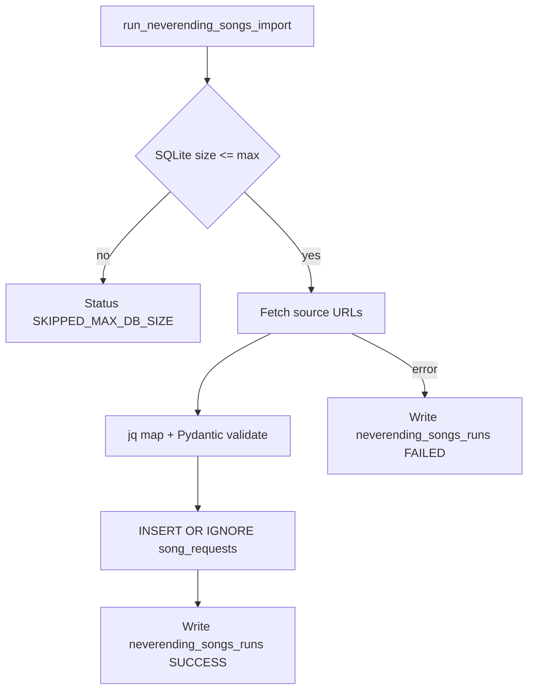

# NeverendingSongs Implementation

Dieses Dokument beschreibt die integrierte NeverendingSongs-Logik innerhalb von Neverending Playlist, inklusive Datenfluss, Mapping und SQLite-Schema als gemeinsame Schnittstelle zwischen Import und Playlist-Synchronisierung.

## Zielbild

- Die bisherige n8n-Importlogik wird in den Server integriert.
- Importierte Songs landen in einer festen SQLite-Struktur.
- Die Playlist-Synchronisierung kann zwischen `SUPABASE` und `SQLITE` umschalten.
- Die Importquellen werden ausschließlich über eine URL-Liste (`SONG_SOURCE_REST_URLS`) konfiguriert.
- Der `source`-Wert wird aus der Domain der jeweiligen URL abgeleitet.
- Der Datenfluss bleibt nachvollziehbar und testbar.

## Feldmapping (n8n -> jq -> Zielstruktur)

Historische n8n-Feldpfade aus `current/n8n_workflow.json`:

- `artist = $json.song.entry[0].artist.entry[0].name`
- `song = $json.song.entry[0].title`
- `airtime = $json.airtime`

Aktuelle jq-Zielstruktur (Basis, `source` als Variable):

```jq
.result.entry[] | {
  artist: .song.entry[0].artist.entry[0].name,
  song: .song.entry[0].title,
  airtime: .airtime,
  source: $source
}
```

## SQLite-Schema (fest)

Die gemeinsame, feste Struktur liegt in `src/core/sqlite_schema.py` und enthält:

- `song_requests`: kompatible Playlist-Felder (`artist`, `song`, `status`, `requested_by`) plus Importmetadaten (`airtime`, `source`, `external_id`, `created_at`)
- `neverending_songs_runs`: Laufhistorie für Importläufe (`run_at`, `status`, `imported_count`, `source_count`, `details`)

## Datenfluss (Phase 2)

```mermaid
flowchart LR
    A[Radio Bob REST API] --> B[JSON Payload]
    B --> C[jq Mapping]
    C --> D[(SQLite song_requests)]
    D --> E[Playlist Sync Source SUPABASE|SQLITE]
    E --> F[Spotify Playlist]
```

## Importlauf (Shell)

- Implementiert in `src/shell/neverending_songs.py`.
- Ablauf:
  - SQLite-Dateigröße prüfen (`SQLITE_MAX_SIZE_BYTES`).
  - Für jede URL in `SONG_SOURCE_REST_URLS` Daten laden.
  - Falls URL keine `start`/`end` Parameter enthält, automatisch 20-Minuten-Fenster anhängen.
  - jq-Mapping anwenden und Records validieren.
  - Daten per `INSERT OR IGNORE` in `song_requests` schreiben.
  - Laufhistorie in `neverending_songs_runs` persistieren.



## Lokale Prüfscripte

- `current/run_neverending_songs_import.py`: Führt den Import mit aktuellen Settings aus.
- `current/check_phase2_sqlite.py`: Zeigt Row-Counts und jeweils den letzten Import-/Song-Eintrag an.
