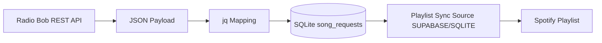
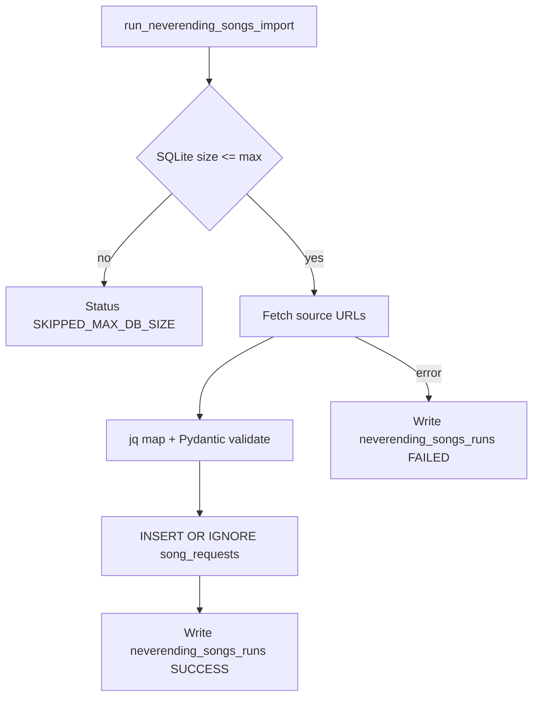
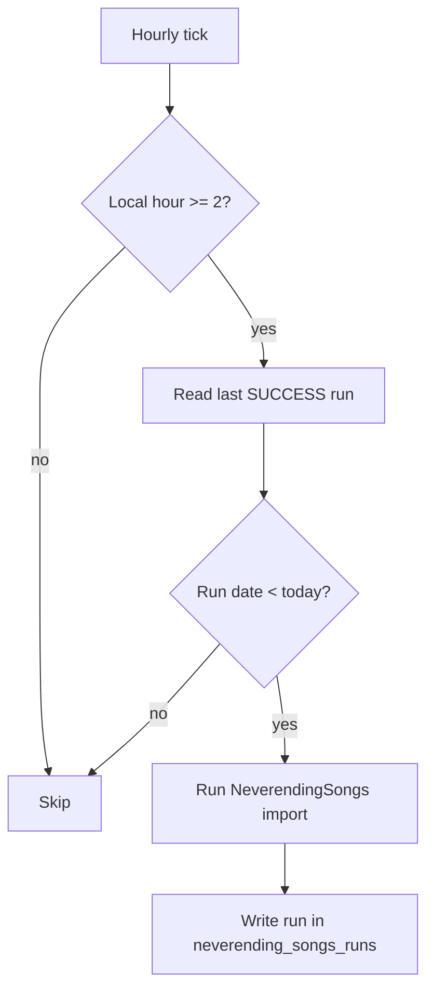

# NeverendingSongs Implementation

Dieses Dokument beschreibt die integrierte NeverendingSongs-Logik innerhalb von Neverending Playlist, inklusive Datenfluss, Mapping und SQLite-Schema als gemeinsame Schnittstelle zwischen Import und Playlist-Synchronisierung.

## Zielbild

- Die bisherige n8n-Importlogik wird in den Server integriert.
- Importierte Songs landen in einer festen SQLite-Struktur.
- Die Playlist-Synchronisierung kann zwischen `SUPABASE` und `SQLITE` umschalten.
- Die Importquellen werden ausschließlich über eine URL-Liste (`SONG_SOURCE_REST_URLS`) konfiguriert.
- Der `source`-Wert wird aus der Domain der jeweiligen URL abgeleitet.
- Der Datenfluss bleibt nachvollziehbar und testbar.

## Feldmapping (n8n -> jq -> Zielstruktur)

Historische n8n-Feldpfade aus dem bisherigen Workflow:

- `artist = $json.song.entry[0].artist.entry[0].name`
- `song = $json.song.entry[0].title`
- `airtime = $json.airtime`

Aktuelle jq-Zielstruktur (Basis, `source` als Variable):

```jq
.result.entry[] | {
  artist: .song.entry[0].artist.entry[0].name,
  song: .song.entry[0].title,
  airtime: .airtime,
  source: $source
}
```

## SQLite-Schema (fest)

Die gemeinsame, feste Struktur liegt in `src/core/sqlite_schema.py` und enthält:

- `song_requests`: kompatible Playlist-Felder (`artist`, `song`, `status`, `requested_by`) plus Importmetadaten (`airtime`, `source`, `external_id`, `created_at`)
- `neverending_songs_runs`: Laufhistorie für Importläufe (`run_at`, `status`, `imported_count`, `source_count`, `details`)

## Datenfluss (Phase 2)



## Importlauf (Shell)

- Implementiert in `src/shell/neverending_songs.py`.
- Ablauf:
  - SQLite-Dateigröße prüfen (`SQLITE_MAX_SIZE_GB`, intern in Bytes umgerechnet).
  - Für jede URL in `SONG_SOURCE_REST_URLS` Daten laden.
  - Wenn `start`/`end` als `HH:MM` gesetzt sind, werden sie automatisch auf das gestrige Datum aufgelöst.
  - jq-Mapping anwenden und Records validieren.
  - Daten per `INSERT OR IGNORE` in `song_requests` schreiben.
  - Laufhistorie in `neverending_songs_runs` persistieren.



## Playlist-Quelle (Phase 3)

- `SONG_SOURCE` steuert den Backend-Adapter für Song-Requests (`SUPABASE` oder `SQLITE`).
- Die FastAPI-Dependency `get_supabase_client()` wählt dynamisch zwischen `ConcreteSupabaseClient` und `ConcreteSqliteClient`.
- `/sync-playlist`, `/clear-played` und der Watchmode nutzen damit dieselbe konfigurierbare Song-Request-Quelle.

## Scheduler (Phase 4)

- Implementiert in `src/shell/neverending_scheduler.py`, gestartet/gestoppt im FastAPI-Lifespan (`src/shell/api.py`).
- Logik:
  - Stündlicher Check (zur vollen Stunde).
  - Tageslauf darf ab 02:00 Lokalzeit ausgeführt werden.
  - Catch-up: Wenn letzter erfolgreicher Lauf nicht vom heutigen Tag ist, wird beim nächsten stündlichen Check importiert.
  - Debug-Override: Bei `DEBUG_SYNC_AT_STARTUP=true` wird beim App-Start einmalig sofort ein Importlauf ausgelöst.
- Persistenz:
  - Letzter erfolgreicher Lauf wird aus `neverending_songs_runs` (Status `SUCCESS`) gelesen.
  - Dadurch ist Catch-up reboot-sicher.



## macOS-Fehlerbenachrichtigung (Phase 5)

- Implementiert in `src/shell/mac_notifications.py`.
- Aktivierung über `ENABLE_MAC_NOTIFICATIONS=true`.
- Titel der Notification: `Neverending Playlist`.
- Nachricht enthält UTC-Fehlerzeitpunkt.
- Verwendet `osascript`; wenn nicht verfügbar, wird nur ein Warning geloggt.
- Eingehängt bei:
  - Scheduler-Importfehlern (`src/shell/neverending_scheduler.py`)
  - Scheduler-Crashs (`src/shell/neverending_scheduler.py`)
  - Unbehandelten Serverfehlern (`src/shell/api.py`, globaler Exception-Handler)

## Dokumentationsabgleich (Phase 6)

- `README.md` ist auf den aktuellen Stand gebracht:
  - konfigurierbare Song-Request-Quelle (`SUPABASE`/`SQLITE`),
  - integrierter NeverendingSongs-Import,
  - Scheduler-Verhalten (02:00 + Catch-up),
  - optionale macOS-Fehlerbenachrichtigungen.
- `.env.example` beschreibt:
  - `SONG_SOURCE_REST_URLS` mit optionalen `HH:MM`-Zeitfenstern (werden auf gestern aufgelöst),
  - optionale Notification-Konfiguration via `ENABLE_MAC_NOTIFICATIONS`.
- `implementation.md` dokumentiert Phasen 2 bis 6 konsistent zur Implementierung.
