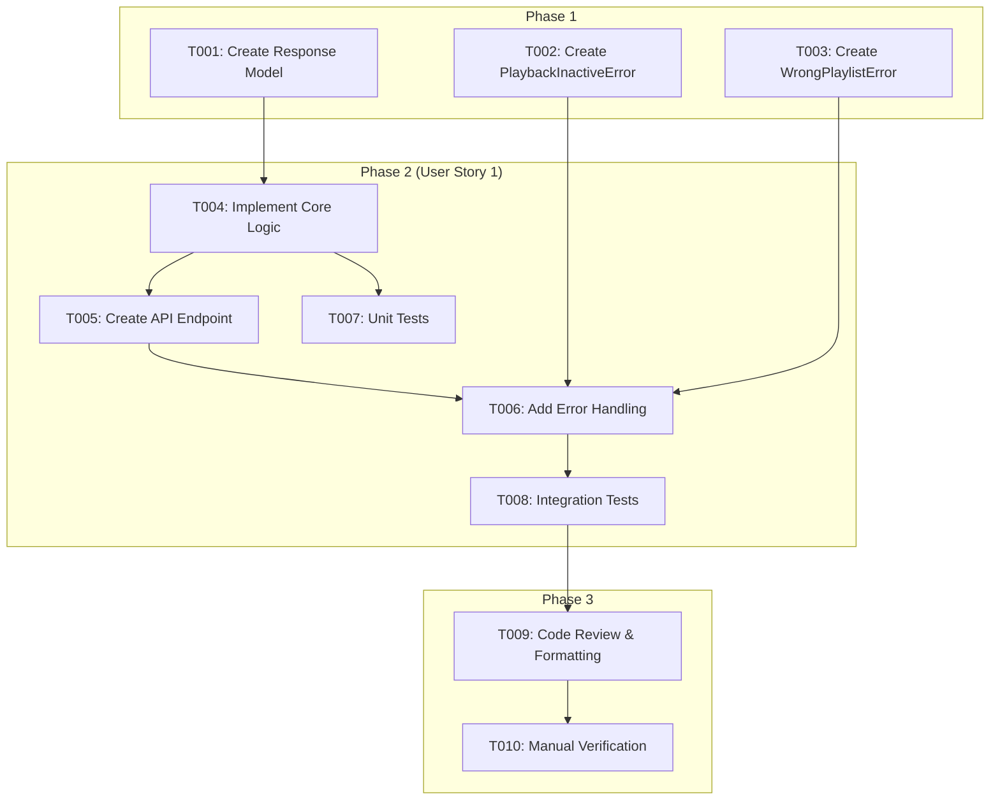

# Actionable Tasks: Clear Played Tracks

**Feature**: Clear Played Tracks in Playlist
**Branch**: `003-clear-played-tracks`

This document outlines the development tasks required to implement the "Clear Played Tracks" feature. The tasks are organized by phase and user story, ensuring a structured and incremental delivery.

## Phase 1: Foundational Tasks

These tasks create the data structures required by both the core logic and the API layer.

- [ ] T001 [P] Create the `ClearPlayedTracksResponse` Pantic model in `src/core/models.py`
- [ ] T002 [P] Create a `PlaylistClearFailure` data class in `src/core/models.py` to represent failure states like `PLAYBACK_INACTIVE` and `WRONG_PLAYLIST`

## Phase 2: User Story 1 - Clear Playlist History

**Goal**: As a user, I want to remove all tracks from my playlist that have already been played.
**Independent Test**: Can be tested by calling the new API endpoint and verifying that the correct tracks are removed from the Spotify playlist.

### Implementation Tasks

- [ ] T003 [US1] Implement the core logic function `clear_played_tracks_from_playlist` in `src/core/services/playlist_service.py` to return a `Result[int, PlaylistClearFailure]`
- [ ] T004 [US1] Create the `POST /clear-played` endpoint in `src/shell/api.py`
- [ ] T005 [US1] Add error handling to the endpoint in `src/shell/api.py` to handle the `Result` object and return appropriate HTTP responses (400, 409, 500)

### Testing Tasks

- [ ] T006 [P] [US1] Write unit tests for `clear_played_tracks_from_playlist` in `tests/unit/test_services.py` to cover both success and failure `Result` cases
- [ ] T007 [P] [US1] Write integration tests for the `POST /clear-played` endpoint in `tests/integration/test_playlist.py`

## Phase 3: Polish & Finalization

- [ ] T008 Review and format all new code using `poe check-all`
- [ ] T009 Manually verify the endpoint functionality against a real Spotify account as a final check

## Dependencies

The implementation is contained within a single user story, making the dependency graph linear.

## Parallel Execution

Tasks marked with `[P]` can be worked on in parallel.

- **During Phase 1**: `T001`, `T002`, and `T003` can be done concurrently.
- **During Phase 2**: `T007` and `T008` (testing tasks) can be started in parallel with their corresponding implementation tasks (`T004`, `T005`, `T006`) if a TDD approach is desired.

## Implementation Strategy

The strategy is to deliver the entire feature as a single unit, as it is composed of one primary user story.

1.  **Foundation**: Implement the Pydantic models first.
2.  **Core Logic**: Develop the pure function in the `core` service layer and ensure it is fully unit-tested.
3.  **Shell Layer**: Build the FastAPI endpoint that connects the core logic to the outside world.
4.  **Integration Testing**: Write tests to verify the endpoint's behavior, including success and error cases.
5.  **Finalization**: Perform a final quality check and manual test.
